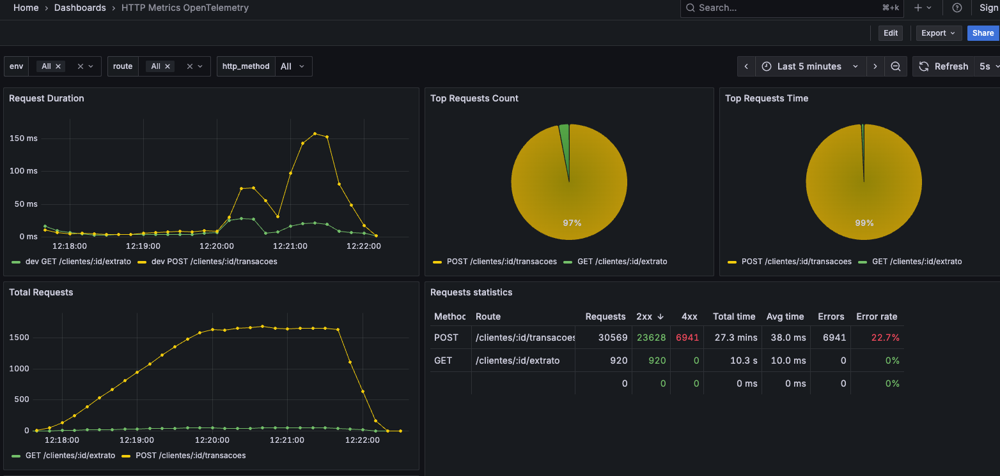

# Submissão para Rinha de Backend, Segunda Edição: 2024/Q1 - Controle de Concorrência

> ⚡️ Este projeto é um **fork** do [projeto original do @4emcos](https://github.com/4emcos/rinha-de-backend-2024-q1-nodejs), vencedor da Rinha de Backend 2024/Q1.
> O objetivo deste fork é usá-lo como **exemplo para demonstrar como monitorar aplicações com OpenTelemetry**.

---

## Tecnologias utilizadas

* `NodeJs` para API com o framework `Fastify`
* `TypeScript` para tipagem
* `nginx` como load balancer
* `postgres` como banco de dados
* Monitoramento com `OpenTelemetry` e `Prometheus`

---

## Observabilidade e Monitoramento

Este fork inclui configurações adicionais de monitoramento:

* Na pasta [`infra`](./infra) estão os arquivos para rodar o **OpenTelemetry Collector** e o **Prometheus**.
* Em [`src/infra/monitoring/otel.ts`](./src/infra/monitoring/otel.ts) está a configuração da coleta, utilizando:

  * [`@opentelemetry/auto-instrumentations-node`](https://www.npmjs.com/package/@opentelemetry/auto-instrumentations-node)
  * [`@fastify/otel`](https://github.com/autotelic/fastify-opentelemetry)

Atualmente, a aplicação usa `nodeAutoInstrumentation` e o plugin `@fastify/otel` para capturar métricas e spans automaticamente.

---

## Como rodar a aplicação

```bash
docker-compose up --build
```

Após subir os containers:

1. Acesse o Grafana em [http://localhost:3000/dashboards](http://localhost:3000/dashboards)
2. Selecione o dashboard **HTTP Metrics OpenTelemetry**, que é baseado neste template oficial do Grafana:
   👉 [https://grafana.com/grafana/dashboards/18860-http-metrics-opentelemetry/](https://grafana.com/grafana/dashboards/18860-http-metrics-opentelemetry/)
3. Em seguida, execute o script abaixo para gerar carga de teste e visualizar os dados no dashboard:

```bash
sh run-load-test.sh
```

📊 Um exemplo de como os gráficos aparecem:



---

## Autor original

* [@4emcos](https://twitter.com/4emcos) @ twitter
* [@4emcos](https://www.linkedin.com/in/4emcos/) @ linkedin
* [4emcos.com](https://www.4emcos.com/) @ Website
